# lsdfonts
[//]: # (fuck lol)
Fonts for use with LSDj 
Feel free to submit your own to be added to this repo. 
\* fonts provided by [Aquellex](https://soundcloud.com/aquellex)  
\*\* fonts provided by dawsx and Aquellex 
\*\*\* fonts taken from http://nfggames.com/games/fontmaker/lister.php with help from Aquellex 
PROT font provided by [Zenkomani](https://soundcloud.com/zenkomani) 
† fonts provided by [Pain Perdu](https://soundcloud.com/pain-perdu)

[Modified Y2K](https://github.com/urbster1/lsdfonts/raw/master/fonts/COOL.lsdfnt) | [\*\*\*Gradius 2](https://github.com/urbster1/lsdfonts/raw/master/fonts/GRD2.lsdfnt) | [\*\*\*Gradius 3](https://github.com/urbster1/lsdfonts/raw/master/fonts/GRD3.lsdfnt) | [\*\*\*Gradius 4](https://github.com/urbster1/lsdfonts/raw/master/fonts/GRD4.lsdfnt)
------------------- | ---------------- | ---------------- | ----------------
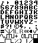 | 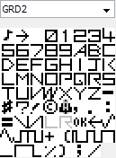 | 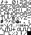 | 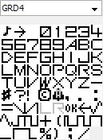

[\*\*Mario Bros](https://github.com/urbster1/lsdfonts/raw/master/fonts/dawsx - Super Mario Bros..lsdfnt) | [\*\*Modified Mario](https://github.com/urbster1/lsdfonts/raw/master/fonts/MRIO.lsdfnt) | [\*\*\*Zero Wing](https://github.com/urbster1/lsdfonts/raw/master/fonts/ZERO.lsdfnt) | [PROT](https://github.com/urbster1/lsdfonts/raw/master/fonts/PROT.lsdfnt) | 
------------ | ---------------- | ------------ | ---------
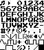 | 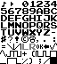 | 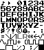 | 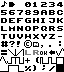 |

[\*\*\*Strider](https://github.com/urbster1/lsdfonts/raw/master/fonts/STRI.lsdfnt) | [Modified Strider](https://github.com/urbster1/lsdfonts/raw/master/fonts/STR2.lsdfnt) | [\*\*\*Super Mario Bros 3 Uppercase](https://github.com/urbster1/lsdfonts/raw/master/fonts/SM3U.lsdfnt) | [\*\*\*Super Mario Bros 3 Lowercase](https://github.com/urbster1/lsdfonts/raw/master/fonts/SM3L.lsdfnt) | 
----------------- | ----------------------------------- | ----------------------------------- | ----------------------------------- |
 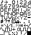 | 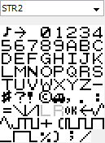 | 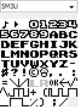 | 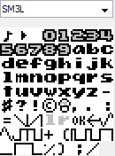 |

[\*2048](https://github.com/urbster1/lsdfonts/raw/master/fonts/aquellex - 2048 (oerg866).lsdfnt) | [\*Sgt. Helmet Training Day](https://github.com/urbster1/lsdfonts/raw/master/fonts/aquellex - Sgt. Helmet Training Day.lsdfnt) | [\*Tetris](https://github.com/urbster1/lsdfonts/raw/master/fonts/aquellex - Tetris.lsdfnt) | [\*Tracker Wide](https://github.com/urbster1/lsdfonts/raw/master/fonts/aquellex - Tracker Wide.lsdfnt)
----------------------- | ------------------- | ------------------------ | --------------- |
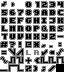 | 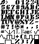 | 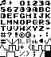 | 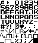 | 

[\*Terminus Lowercase](https://github.com/urbster1/lsdfonts/raw/master/fonts/dawsx - Terminus Lowercase.lsdfnt) | [\*\*\*Simpsons](https://github.com/urbster1/lsdfonts/raw/master/fonts/aquellex - The Simpsons (Konami).lsdfnt) | [\*\*\*Afterburner](https://github.com/urbster1/lsdfonts/raw/master/fonts/aquellex - Afterburner (Sega).lsdfnt) | [Modified ZERO](https://github.com/urbster1/lsdfonts/raw/master/fonts/ZEROmod.lsdfnt)
----------------- | ----------------------- | --------------------- | --------------------- |
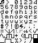 | 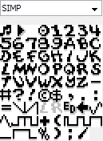 | 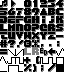 | 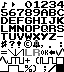 | 

 [†Trash80](https://github.com/urbster1/lsdfonts/raw/master/fonts/TR80.lsdfnt) | [†Metal Gear](https://github.com/urbster1/lsdfonts/raw/master/fonts/GEAR.lsdfnt) |  [†PCB Artist](https://github.com/urbster1/lsdfonts/raw/master/fonts/PCB.lsdfnt) | [†Pokémon 6x7](https://github.com/urbster1/lsdfonts/raw/master/fonts/PKMN.lsdfnt) |
------------------- | -------------- | ---------------- | ----------------- |
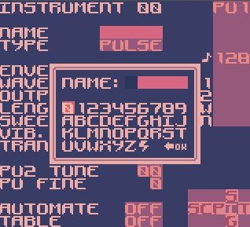 | 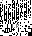 | 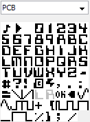 | 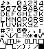 |

 [†Pokémon 7x7](https://github.com/urbster1/lsdfonts/raw/master/fonts/PKRE.lsdfnt) |
------------------- | 
 | 
