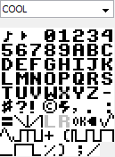
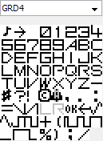
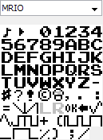
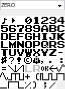
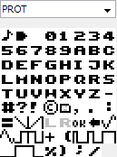
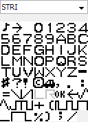

# lsdfonts
Fonts for use with LSDj

Feel free to submit your own to be added to this repo.

Gradius, Zero Wing, and Strider fonts taken from http://nfggames.com/games/fontmaker/lister.php

[COOL - Modified Y2K](COOL.lsdfnt) | [GRD2 - Gradius 2](GRD2.lsdfnt) | [GRD3 - Gradius 3](GRD3.lsdfnt) | [GRD4 - Gradius 4](GRD4.lsdfnt)
------------------- | ---------------- | ---------------- | ----------------
 |  |  | 

[MRIO - Mario](MRIO.lsdfnt) | [ZERO - Zero Wing](ZERO.lsdfnt) | [PROT](PROT.lsdsng) | [STRI - Strider](STRI.lsdsng)
------------ | ---------------- | ------------ | ---------
 |  |  | 
