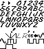

# LSDFonts
[//]: # (oops lol)
Fonts for use with LSDj (using [LSDPatch](https://github.com/jkotlinski/lsdpatch)). 
Click on the image to download the PNG. 
Feel free to submit your own to be added to this repo, or let me know if you have a request for a font to be added. 
\* fonts provided by [Aquellex](https://soundcloud.com/aquellex)  
\*\* fonts provided by [dawsx](http://chipmusic.org/forums/topic/10946/custom-lsdj-fonts/) and Aquellex 
\*\*\* fonts taken from http://nfggames.com/games/fontmaker/lister.php with help from Aquellex 
† fonts provided by [Pain Perdu](https://soundcloud.com/pain-perdu) 
Original LCD and 7 fonts created by [SurfaceDragon](http://chipmusic.org/forums/topic/4916/lsdj-ips-graphics-patch-more/) 
PROT font provided by [Zenkomani](https://soundcloud.com/zenkomani) 
M9MF font provided by [MelonadeM](https://twitter.com/_melonadem) 
IBM Console, Flixel/Nokia Cellphone FC, Litro fonts provided by [Eiyeron](https://github.com/Eiyeron/) 
Original Lizard NES font by [bradsmith](http://lizardnes.com) 
Original Monofur font from [http://eurofurence.net/monofur.html](http://eurofurence.net/monofur.html) 
SMOL font provided by [toasterpastries](https://twitter.com/t0asterpastries) 
Original NEScape! font by [Kevin Hanley](https://khangames.itch.io/nescape) 
BUBL font provided by [.exe](https://dotexe.space) 
DEFF, DUMB, and MECH fonts provided by [DEFENSE MECHANISM](https://defensemech.com) 
BOLD and NICE fonts provided by [Kabcorp](https://www.youtube.com/channel/UCssWueVur72RA0754f3GBdA) 
ALKI, CIRC, KRYZ, OUTLINE, OPTC and ZEPHYR fonts provided by [quantumtui](https://twitter.com/quantumtui) 
VIRT font provided by [MicroD](https://mirodmusic.com) 
RVN font provided by [Ravancloak](https://ravancloak.bandcamp.com/) 
If you have provided a font and have not been credited, please feel free to reach out or submit a pull request by editing this README. 

7\*    
7MOD\*    
1943\*\*\*    
2048\*    
Aero Fighters\*\*\*    
Afterburner\*\*\*    
ALKI    
Arabian Magic (Capcom)\*\*\*   
Art of Fighting 2 (SNK)\*\*\*   
Assault (Namco)\*\*\*   
Asterix (Konami)\*\*\*   
ATASCII\*\*\*   
Aurail (Sega)\*\*\*   
Avengers (Capcom)\*\*\*   
Batsugun (Toaplan)\*\*\*   
Bay Route (Sega)\*\*\*   
BattleCircuit (Capcom)\*\*\*   
Battle Bakraid (Eighting)\*\*\*   
Black Tiger (Capcom)\*\*\*   
Blazing Star\*\*\*    
Blood Warrior (Kaneko)\*\*\*   
Bonanza Bros (Sega)\*\*\*   
BOLD    
Boogie Wings (Data East)\*\*\*   
BOOM    
BUBL    
C64\*\*    
Modified C64    
Captain Sky Hawk (RARE)\*\*\*   
Castlevania 3   
Chiki Chiki Boys (Capcom)\*\*\*   
CIRC    
Cliffhanger - Edward Randy (DataEast)\*\*\*   
Commando-Special (Capcom)\*\*\*   
Dance Dance Revolution (Konami)\*\*\*   
Dangerous Seed\*\*\*    
DEFF    
Detana Twinbee (Konami)\*\*\*   
Dimahoo (Raizing)\*\*\*   
DoDonPachi (Cave)\*\*\*   
DOS Uppercase\*    
DOS mod    
Dragon Breed (Irem)\*\*\*   
Dragon Spirit (Namco)\*\*\*   
DUMB    
Dynamite Dux (slight mod)\*\*\*    
F1 Dream (Capcom)\*\*\*   
Fantasy Zone (Sega)\*\*\*   
Flak Attack\*\*\*    
Flixel    
Flying Shark (Taito)\*\*\*   
Gain Ground (Sega)\*\*\*   
Garou Densetsu (SNK)\*\*\*   
Ghosts n Goblins (Capcom)\*\*\*   
Ghouls n Ghosts (Capcom)\*\*\*   
Gondomania (Data East)\*\*\*   
Gradius 2\*\*\*    
Gradius 3\*\*\*    
Gradius 4\*\*\*    
GunNail (NMK)\*\*\*   
Gun.Smoke (Capcom)\*\*\*   
Hacha Mecha Fighter (NMK)\*\*\*   
Hat Trick Hero 95 (Taito)\*\*\*   
IBM Console    
Image Fight (IREM)\*\*\*   
Last Resort (SNK)\*\*\*   
Litro Lowercase    
Litro Uppercase    
Lizard NES    
Kaiser Knuckle (Taito)\*\*\*   
Ketsui (Cave)\*\*\*   
Kiki Kaikai (Taito)\*\*\*   
King of Fighters 97 (SNK)\*\*\*   
King of Fighters 2000 (SNK)\*\*\*   
King of Fighters 2001 (SNK)\*\*\*   
Kirameki Star Road (Taito)\*\*\*   
KLAX†   
Konami NES   
KRYZ    
Mario Bros\*\*    
Modified Mario\*\*    
Mars Matrix (Capcom)\*\*\*   
MECH    
Metal Gear†    
Modified LCD    
Monofur    
Monofur (No aliasing)    
Monofur Caps (No aliasing)    
M9MF    
NEScape! (slight mod)    
NICE    
NIMA    
NOSHADE   
OPTC    
OUTLINE    
PCB Artist†    
PICO8    
PICO8 lowercase    
Pokémon 6x7†    
Pokémon 7x7†    
Pokémon 7x7 Bold†    
PROT    
Renoise    
RVN    
Sgt. Helmet Training Day\*    
SHADED   
Simpsons\*\*\*    
SMOL    
Sonic Robo Blast 2 Console\*    
Strider\*\*\*    
Modified Strider    
Super Mario Bros 3 Lowercase\*\*\*    
Super Mario Bros 3 Uppercase\*\*\*    
Terminus Lowercase\*    
Tetris\*    
Tracker Wide\*   
Trash80†    
Twin Cobra\*\*\*    
Twin Qix\*\*\*    
Twinbee\*\*\*    
Virt    
Wild Pilot\*\*\*    
Modified Y2K    
ZEPHYR    
Zero Wing\*\*\*    
Modified ZERO    
Modified ZERO 6x7    
Modified ZERO 2, the most readable LSDj font in existence    
