# LSDFonts
[//]: # (fuck lol)
Fonts for use with LSDj (using [LSDPatch](https://github.com/eiyeron/lsdpatch)). 
Note : this LSDPatcher version is a fork of the [original verision](https://github.com/jkotlinski/lsdpatch) by jkotlinski that allows for PNG import/export with shown font pictures. 
Click on the title of the font to download the .lsdfnt, or click on the image to download the PNG. 
Feel free to submit your own to be added to this repo, or let me know if you have a request for a font to be added. 
\* fonts provided by [Aquellex](https://soundcloud.com/aquellex)  
\*\* fonts provided by [dawsx](http://chipmusic.org/forums/topic/10946/custom-lsdj-fonts/) and Aquellex 
\*\*\* fonts taken from http://nfggames.com/games/fontmaker/lister.php with help from Aquellex 
† fonts provided by [Pain Perdu](https://soundcloud.com/pain-perdu) 
Original LCD and 7 fonts created by [SurfaceDragon](http://chipmusic.org/forums/topic/4916/lsdj-ips-graphics-patch-more/) 
PROT font provided by [Zenkomani](https://soundcloud.com/zenkomani) 
M9MF font provided by [MelonadeM](https://twitter.com/_melonadem) 
IBM Console, Flixel/Nokia Cellphone FC, Litro fonts provided by [Eiyeron](https://github.com/Eiyeron/) 
Original Lizard NES font by [bradsmith](http://lizardnes.com) 
 Original Monofur font from [http://eurofurence.net/monofur.html](http://eurofurence.net/monofur.html) 
SMOL font provided by [toasterpastries](https://twitter.com/t0asterpastries) 

[7\*](https://github.com/urbster1/lsdfonts/raw/master/fonts/7.lsdfnt)  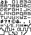  
[7MOD\*](https://github.com/urbster1/lsdfonts/raw/master/fonts/7MOD.lsdfnt)  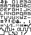  
[2048\*](https://github.com/urbster1/lsdfonts/raw/master/fonts/aquellex%20-%202048%20(oerg866).lsdfnt)    
[Afterburner\*\*\*](https://github.com/urbster1/lsdfonts/raw/master/fonts/aquellex%20-%20Afterburner%20(Sega).lsdfnt)    
[Aero Fighters\*\*\*](https://github.com/urbster1/lsdfonts/raw/master/fonts/AERO.lsdfnt)  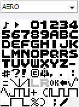  
[Blazing Star\*\*\*](https://github.com/urbster1/lsdfonts/raw/master/fonts/STAR.lsdfnt)  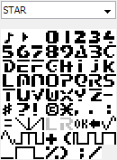  
[C64\*\*](https://github.com/urbster1/lsdfonts/raw/master/fonts/C64.lsdfnt)  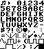  
[Modified C64](https://github.com/urbster1/lsdfonts/raw/master/fonts/C64M.lsdfnt)  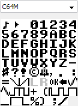  
[Dangerous Seed\*\*\*](https://github.com/urbster1/lsdfonts/raw/master/fonts/SEED.lsdfnt)  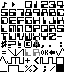  
[DOS Uppercase\*](https://github.com/urbster1/lsdfonts/raw/master/fonts/DOSU.lsdfnt)  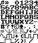  
[DOS mod](https://github.com/urbster1/lsdfonts/raw/master/fonts/DOSM.lsdfnt)  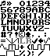  
[Dynamite Dux (slight mod)\*\*\*](https://github.com/urbster1/lsdfonts/raw/master/fonts/DUX.lsdfnt)  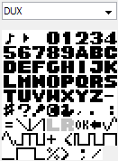  
[Flak Attack\*\*\*](https://github.com/urbster1/lsdfonts/raw/master/fonts/FLAK.lsdfnt)  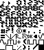  
[Flixel](https://github.com/urbster1/lsdfonts/raw/master/fonts/LTRL.lsdfnt)    
[Gradius 2\*\*\*](https://github.com/urbster1/lsdfonts/raw/master/fonts/GRD2.lsdfnt)    
[Gradius 3\*\*\*](https://github.com/urbster1/lsdfonts/raw/master/fonts/GRD3.lsdfnt)    
[Gradius 4\*\*\*](https://github.com/urbster1/lsdfonts/raw/master/fonts/GRD4.lsdfnt)    
[IBM Console](https://github.com/urbster1/lsdfonts/raw/master/fonts/IBMC.lsdfnt)  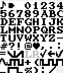  
[Litro Lowercase](https://github.com/urbster1/lsdfonts/raw/master/fonts/LTRL.lsdfnt)  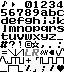  
[Litro Uppercase](https://github.com/urbster1/lsdfonts/raw/master/fonts/LTRU.lsdfnt)  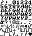  
[Lizard NES](https://github.com/urbster1/lsdfonts/raw/master/fonts/LZRD.lsdfnt)  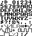  
[KLAX†](https://github.com/urbster1/lsdfonts/raw/master/fonts/KLAX.lsdfnt) 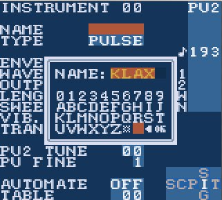  
[Mario Bros\*\*](https://github.com/urbster1/lsdfonts/raw/master/fonts/dawsx%20-%20Super%20Mario%20Bros..lsdfnt)    
[Modified Mario\*\*](https://github.com/urbster1/lsdfonts/raw/master/fonts/MRIO.lsdfnt)    
[Metal Gear†](https://github.com/urbster1/lsdfonts/raw/master/fonts/GEAR.lsdfnt)    
[Modified LCD](https://github.com/urbster1/lsdfonts/raw/master/fonts/LCD.lsdfnt)  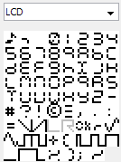  
[Monofur](https://github.com/urbster1/lsdfonts/raw/master/fonts/MONO.lsdfnt)  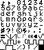  
[M9MF](https://github.com/urbster1/lsdfonts/raw/master/fonts/M9MF.lsdfnt)  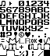  
[PCB Artist†](https://github.com/urbster1/lsdfonts/raw/master/fonts/PCB.lsdfnt)    
[PICO8](https://github.com/urbster1/lsdfonts/raw/master/fonts/pico.lsdfnt)  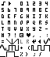  
[PICO8 lowercase](https://github.com/urbster1/lsdfonts/raw/master/fonts/pico-small.lsdfnt)  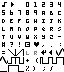  
[Pokémon 6x7†](https://github.com/urbster1/lsdfonts/raw/master/fonts/PKMN.lsdfnt)    
[Pokémon 7x7†](https://github.com/urbster1/lsdfonts/raw/master/fonts/PKRE.lsdfnt)    
[Pokémon 7x7 Bold†](https://github.com/urbster1/lsdfonts/raw/master/fonts/PKBD.lsdfnt)  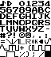  
[PROT](https://github.com/urbster1/lsdfonts/raw/master/fonts/PROT.lsdfnt)    
[Renoise](https://github.com/urbster1/lsdfonts/raw/master/fonts/renoise.lsdfnt)  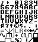  
[Sgt. Helmet Training Day\*](https://github.com/urbster1/lsdfonts/raw/master/fonts/aquellex%20-%20Sgt.%20Helmet%20Training%20Day.lsdfnt)    
[Simpsons\*\*\*](https://github.com/urbster1/lsdfonts/raw/master/fonts/aquellex%20-%20The%20Simpsons%20(Konami).lsdfnt)    
[SMOL](https://github.com/psgcabal/lsdfonts/raw/master/fonts/SMOL.lsdfnt)  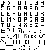  
[Strider\*\*\*](https://github.com/urbster1/lsdfonts/raw/master/fonts/STRI.lsdfnt)    
[Modified Strider](https://github.com/urbster1/lsdfonts/raw/master/fonts/STR2.lsdfnt)    
[Super Mario Bros 3 Lowercase\*\*\*](https://github.com/urbster1/lsdfonts/raw/master/fonts/SM3L.lsdfnt)    
[Super Mario Bros 3 Uppercase\*\*\*](https://github.com/urbster1/lsdfonts/raw/master/fonts/SM3U.lsdfnt)    
[Terminus Lowercase\*](https://github.com/urbster1/lsdfonts/raw/master/fonts/dawsx%20-%20Terminus%20Lowercase.lsdfnt)    
[Tetris\*](https://github.com/urbster1/lsdfonts/raw/master/fonts/aquellex%20-%20Tetris.lsdfnt)    
[Tracker Wide\*](https://github.com/urbster1/lsdfonts/raw/master/fonts/aquellex%20-%20Tracker%20Wide.lsdfnt)   
[Trash80†](https://github.com/urbster1/lsdfonts/raw/master/fonts/TR80.lsdfnt)    
[Modified Y2K](https://github.com/urbster1/lsdfonts/raw/master/fonts/COOL.lsdfnt)    
[Zero Wing\*\*\*](https://github.com/urbster1/lsdfonts/raw/master/fonts/ZERO.lsdfnt)    
[Modified ZERO](https://github.com/urbster1/lsdfonts/raw/master/fonts/ZEROmod.lsdfnt)    
[Modified ZERO 6x7](https://github.com/urbster1/lsdfonts/raw/master/fonts/ZERO6.lsdfnt)  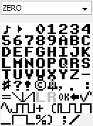  
[Modified ZERO 2, the most readable LSDj font in existence](https://github.com/urbster1/lsdfonts/raw/master/fonts/ZEROmod2.lsdfnt)  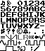  
